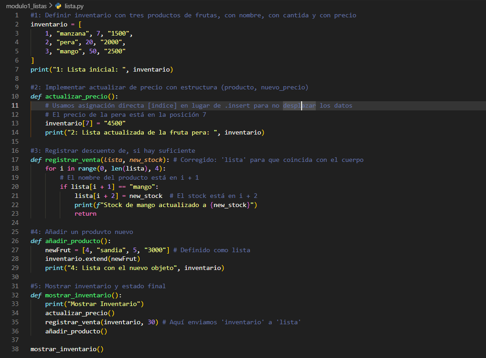
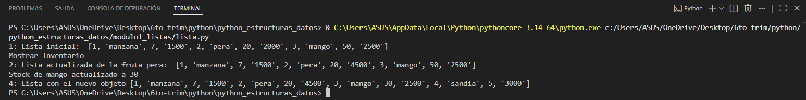
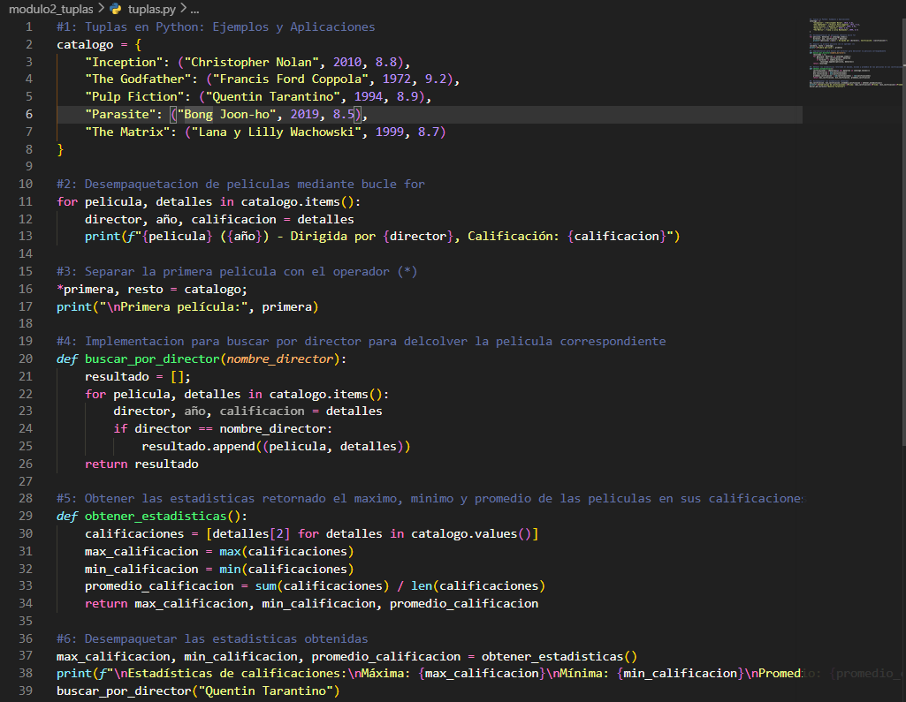
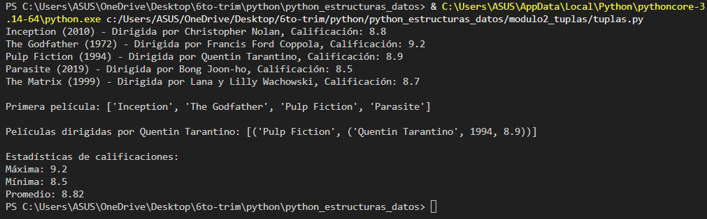
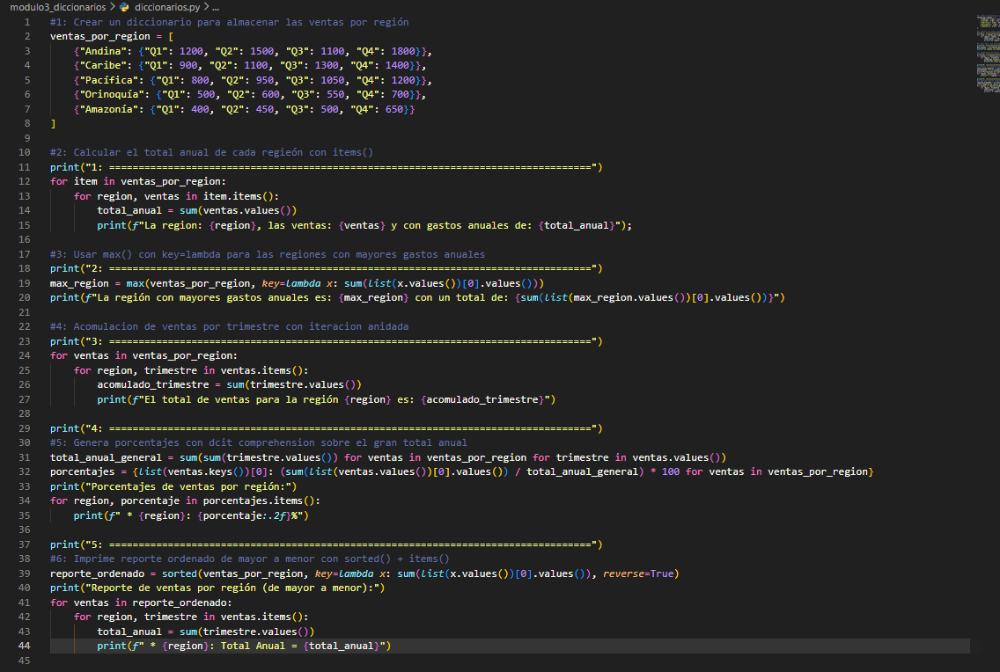
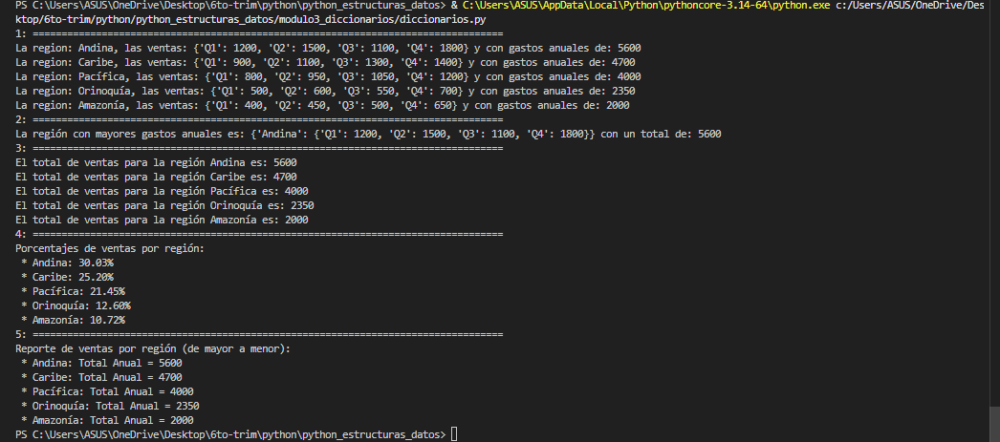
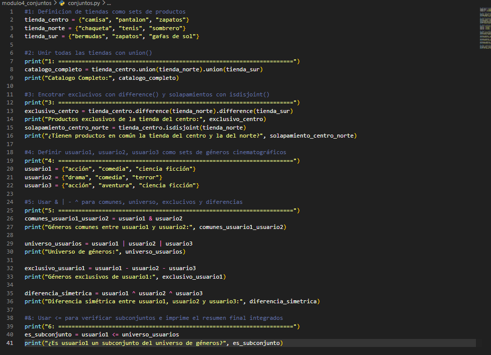
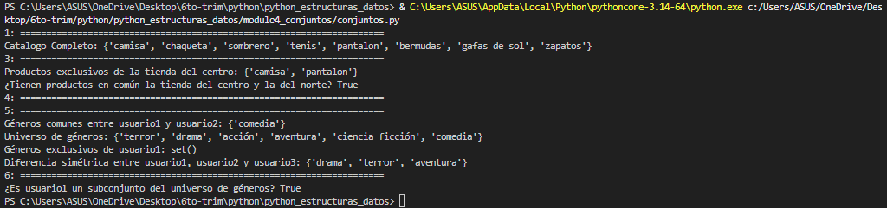
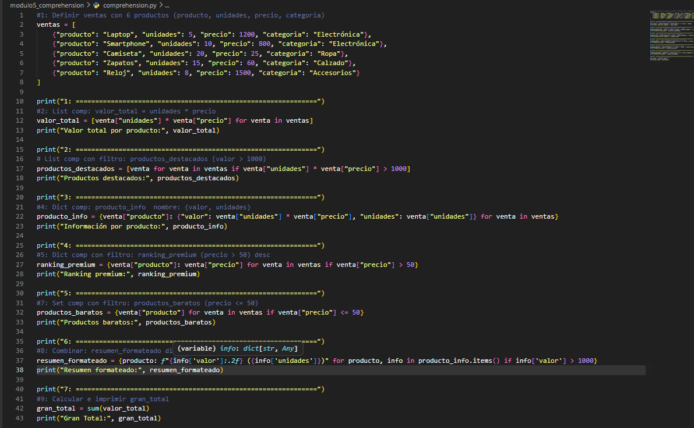
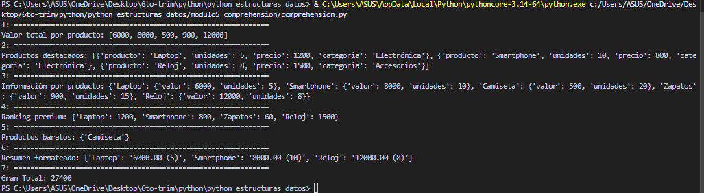

# 🐍 Proyecto: Estructuras de Datos en Python

---

## 📌 Descripción del proyecto

Este proyecto fue desarrollado con el propósito de fortalecer el manejo de estructuras de datos en Python mediante ejercicios prácticos enfocados en la resolución de problemas.

A lo largo del proyecto se implementaron diferentes módulos relacionados con:

* Gestión de listas
* Manipulación de tuplas
* Uso de diccionarios
* Operaciones con conjuntos (sets)
* Implementación de comprehensions

Cada módulo permitió aplicar lógica de programación, procesamiento de datos y buenas prácticas en Python.

---

## 📚 Temas aprendidos

Durante el desarrollo del proyecto se trabajaron los siguientes conceptos:

### 🔹 Estructuras de datos

* Listas
* Tuplas
* Diccionarios
* Sets (conjuntos)

### 🔹 Técnicas de programación

* Funciones personalizadas
* Desempaquetado de datos
* Uso de `lambda`
* Uso de `sorted()`, `max()` y `sum()`

### 🔹 Comprehensions

* List Comprehension
* Dict Comprehension
* Set Comprehension

### 🔹 Procesamiento de datos

* Filtrado de información
* Ordenamiento
* Cálculo de estadísticas
* Generación de reportes

---

## 🧩 Evidencia de retos resueltos

### ✔️ Módulo Listas

* Gestión de inventarios
* Actualización de productos
* Registro de ventas

### ✔️ Módulo Tuplas

* Catálogo de películas
* Búsqueda por director
* Estadísticas de puntuaciones

### ✔️ Módulo Diccionarios

* Ventas por región
* Reportes ordenados
* Cálculo de porcentajes

### ✔️ Módulo Conjuntos

* Comparación de productos
* Elementos comunes y exclusivos
* Operaciones con sets

### ✔️ Módulo Comprehensions

* Optimización de código
* Transformación rápida de datos
* Creación de resúmenes dinámicos

---

## 📸 Capturas de ejecución

### 🔹 Módulo Listas

#### Código



#### Ejecución en terminal



---

### 🔹 Módulo Tuplas

#### Código



#### Ejecución en terminal



---

### 🔹 Módulo Diccionarios

#### Código



#### Ejecución en terminal



---

### 🔹 Módulo Conjuntos

#### Código



#### Ejecución en terminal



---

### 🔹 Módulo Comprehensions

#### Código



#### Ejecución en terminal



---

## 💭 Reflexión personal del aprendizaje

Este proyecto permitió desarrollar habilidades importantes en programación utilizando Python.

A través de los ejercicios se comprendió mejor cómo funcionan las estructuras de datos y cómo pueden aplicarse para resolver problemas reales de manera eficiente.

También se fortaleció el pensamiento lógico y la capacidad de analizar situaciones paso a paso antes de implementar una solución.

El uso de comprehensions y funciones avanzadas ayudó a escribir código más limpio, organizado y optimizado.

En conclusión, este proyecto representó una experiencia valiosa para mejorar tanto el conocimiento técnico como la capacidad de resolución de problemas.

---

## 🚀 Cómo ejecutar el proyecto

```bash id="fsxgrf"
python nombre_archivo.py
```

---

## 👩‍💻 Autor

**Mariana Bastidas**
